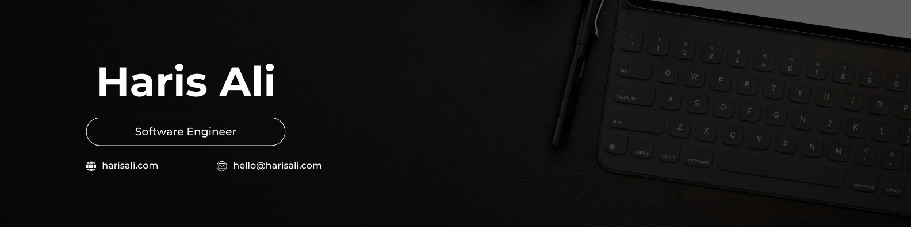

# 💫 About Me:
👋 Hi there! I'm **Haris Ali**, a passionate developer with a strong interest in DevOps and software engineering. I'm currently focused on building efficient, scalable applications and optimizing deployment processes.

## 🌱 Currently Learning
- Docker and container orchestration
- Cloud technologies (AWS, Azure, etc.)
- Continuous Integration/Continuous Deployment (CI/CD) practices

## 🌍 Connect with Me
I'm always eager to collaborate on exciting projects and learn from others. Feel free to check out my repositories and reach out if you’d like to connect!

## 🌐 Socials:
   

# 💻 Tech Stack:
### Programming Languages
               

### Frameworks & Libraries
          

### Databases
        

### DevOps & CI/CD
              

### Cloud & Hosting
              

### Monitoring & Security
        

### Web Servers & Reverse Proxies
    

### Version Control
        

### Other Tools
            

# 📊 GitHub Stats:
 
 

---

<!-- Proudly created with GPRM ( https://gprm.itsvg.in ) -->
